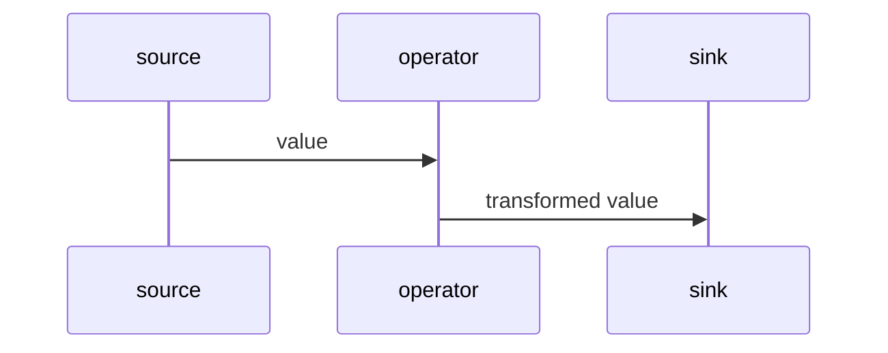
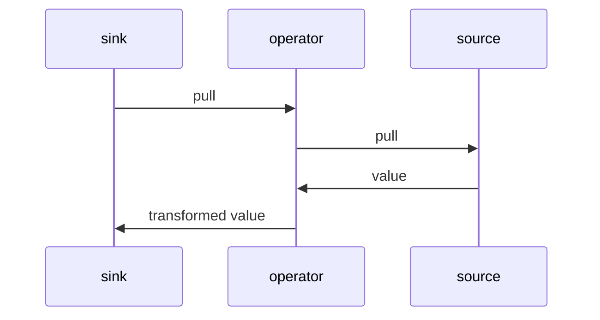

# Rheoscape

## A functional reactive programming library for embedded devices, written in C++.

Rheoscape brings the functional reactive programming style to embedded development, using embedded-friendly idioms. It helps you tame your polling-driven loop code and construct streams of data that look almost magical!

Here's the classic Arduino 'blink without delay' sketch, rewritten with Rheoscape:

```c++
#include <Arduino.h>
#include <rheoscape.h>

using namespace rheoscape;
using namespace operators;
using namespace sources;
using namespace sinks::arduino;

static pull_fn blink_led;

void setup() {
    // Construct a pipe from the clock, through a 50% 2-second wave, to a GPIO.
    blink_led = from_clock<arduino_millis_clock>()
        // 2 second cycle @ 0.5 duty cycle = 1 second on / 1 second off
        | pwm_wave(constant(arduino_millis_clock::duration(2000)), constant(0.5f))
        | digital_pin_sink(3);
}

void loop() {
    // Poll the pipe every time around the loop.
    blink_led();
}
```

This example shows the basic structure of a sketch built with Rheoscape:

1. Define a static 'pull' variable.
2. Construct a pipeline in `setup`, assigning it to the static pull variable.
3. Call the pull variable, which contains a function, in your loop.

For more complex examples, see the `examples/` folder.

## Why choose Rheoscape?

* You're tired of the mess of imperative code in your `setup` and `loop` functions, most of which does nothing but poll sensors, clocks, and GPIOs.
* You're not ready to give up C++ for one of those cool but exotic embedded FRP languages and their exotic toolchains.
* You like the FRP style, but you still want to have control over what gets executed and when.

## Get started

Rheoscape is, unashamedly, a C++20 project. It uses a lot of C++20's features to make for a graceful developer experience.

### Prerequisites

* GCC version 10 (you might be able to use Clang too, but I don't have any experience with it).

### Installing

If you're using **PlatformIO**:

1. Open up your project's `platformio.ini` file.
2. Make sure `build_unflags` contains `-std=gnu++11 -std=gnu++14 -std=gnu++17` and `build_flags` contains `-std=gnu++20`.
3. Add `pdaoust/rheoscape-reactive` to the list of `lib_deps` for any environment you want to use Rheoscape in.

If you're using **Arduino IDE**:

1. Open up your project in the IDE.
2. Go to **Sketch** > **Include Library** > **Manage Libraries**.
3. Search for `rheoscape-reactive` and install it into your project.

### Using

Rheoscape is a header-only library, so it gets built right into your binary. Add this to the top of your files:

```c++
#include <rheoscape.hpp>
```

That's it! Happy streaming.

## Dependencies

If dependencies don't get installed automatically, you'll need to at least install `fmtlib/fmt`. Many sources and sinks also require `Arduino.h` and will be disabled if it can't be found. Certain sources and sinks might also require the following libraries:

* `claws/BH1750@^1.3.0`
* `adafruit/Adafruit GFX Library@^1.12.1`
* `adafruit/Adafruit SSD1306@^2.5.14`
* `lvgl/lvgl@^9.3.0`
* `milesburton/DallasTemperature@^4.0.4`
* `bodmer/TFT_eSPI@^2.5.43` (ESP32 only)
* `robtillaart/SHT2x@^0.5.2`
* `bblanchon/ArduinoJson@^7.4.2`
* `madhephaestus/ESP32Servo@^3.0.9` (ESP32 only)

## Supported platforms

Rheoscape works with any C++ project, but the Arduino sources and sinks only work on embedded devices in programs based on the Arduino framework. Currently the ESP32 and RP2040 Arduino cores are supported across all sources and sinks.

## License

Rheoscape is licensed under the [GPL v3](https://www.gnu.org/licenses/gpl-3.0.en.html).

## Important concepts

Rheoscape is based on the idea of **streams** between [**sources**](#source) and [**sinks**](#sink). Almost everything in Rheoscape is just a callable. That's the entire core of Rheoscape -- a pattern for agreeing on how a source and a sink should interact to create a stream. (But Rheoscape does come with a decent-sized standard library too.)

### Source

A source emits values. It's just a function that receives an observer, or [**push function**](#push-function) and returns a [**pull function**](#pull-function) with which you poll the source.

```
push = (value) -> void
pull = (void) -> void
source = (push) -> pull
```

Some sources push their values without being asked. We call them **push sources**. But these are very rare -- generally, you collect all the pull functions from the tail ends of your graphs, then call them in the main program loop.

_Why pull? Didn't you say this would make polling go away?_ Well, not _go away_, just become much tidier. The polling and timing logic is all wrapped up in the stream. Arduino isn't very push-friendly. The microcontrollers it runs on have a few interrupts, but general wisdom says your interrupt handlers should do as little as possible -- certainly not call observer functions that might have a bunch of processing logic attached to them.

But polling also gives you the choice to only exercise the parts of your reactive graph that you care about -- the ones that make changes happen. If the user is on a screen that doesn't show temperature, there's no need to pull on the stream that reads the temperature sensor.

These reasons are probably why most Arduino sensor and network server libraries (which Rheoscape depends on) need you to call on some sort of polling function. So Rheoscape just follows that pattern, for the most part.

There are just a few exceptions to the pull-driven pattern:

* [**States**](#state), which are sources that hold a mutable value and push state changes as soon as they happen.
* Certain [**operators**](#operator) such as `share` and `tee` have 'side' streams that they push values to whenever the 'main' stream receives a value.

You can think of a source function as a stream factory -- you can bind different sinks to a source and get entirely independent streams. That way, when sink A pulls on a source, it doesn't push a value to sink B's push function. (Not usually anyway -- there are some exceptions.)

Here's a simple source, just a lambda that returns the number 3 whenever it's pulled:

```c++
auto threes_source = [](auto push) {
    return [push]() {
        push(3);
    };
};
```

The returned lambda is the pull function that pushes the number 3 to any push function that is passed to it. You can see that a new pull lambda gets created every time the source is called with a new push function.

#### Push function

A push function is a simple observer function. It takes one argument, typed to the value type that the source emits, and does something useful with it. It doesn't return anything.

#### Pull function

As mentioned, a source returns a pull function when it's called. This is a handle that lets the sink request a new value, which will be delivered to the sink's push function.

### Sink

A sink isn't a concrete thing; it's more of an idea -- it's just the act of passing a push function to a source and getting a pull function in return. Sinking, or binding, to a source can be as simple as passing a lambda and storing the pull function in a variable for later use. This example uses the `threes_source` from above:

```c++
auto log_threes = threes_source([](int v) {
    Serial.print("Got a number: ");
    Serial.println(v);
});
```

Every time you call `log_threes()`, it'll print a message to the serial port.

```c++
void loop() {
    log_threes();
}
```

**At its simplest, this is all that Rheoscape is.** With no supporting library code, the two functions above have implemented the Rheoscape pattern with a very simple stream. All Rheoscape does is define a bunch of concepts and type traits to formalise the pattern, and supply syntactic sugar and a big standard library to accelerate your development.

### State

A state holds, well, state! It keeps track of mutable values and provides both a source function (which emits values whenever the state is changed, but can also be pulled any time you like) and a sink function (which updates the state with each value pushed to it). Other frameworks call them 'reactive values'.

Currently there are two different state types:

* `MemoryState`, which is backed by RAM
* `EepromState`, which is backed by NVRAM via the Arduino `EEPROM` library

State objects have a common interface:

* `get_source_fn(bool initial_push = true)`: Get a source function that presents the value in the state object as a stream. `initial_push` controls whether sinks get pushed a value as soon as they bind to the source.
* `get_setter_sink_fn(bool push_on_set = true)`: Get a pullable sink function that updates the state whenever values are pushed to it. `push_on_set` controls whether the state's source function also pushes values downstream.
* `get_setter_push_fn(bool push_on_set = true)`: Get a push function that you can bind to sources.
* `set(T value, bool push = true)`: Update the state, and optionally push its value to bound sinks.
* `get()`: Get the value. You should guard calls to this function with `has_value()` or use `try_get()` instead.
* `has_value()`: Check whether the state has a value.
* `try_get()`: Get the value wrapped in a `std::optional`, if it exists.
* `add_sink(PushFn push, bool initial_value = true)`: An alternative way of binding a push function to the state rather than using its source function.

#### Operator

Something can be both a source and a sink at the same time -- we call these **operators**, and they transform the shape of the stream as it passes downstream from source to sink. Familiar functional operators like `map`, `filter`, and `scan` are included in the standard library. Operators accept a source function (and maybe other arguments) and return a source function that represents a transformed stream.

You build operators using their factory functions. You can do it two ways -- nested style, where the primary source is the first argument:

```c++
auto threes_squared = map(
    threes_source,
    [](int v) { return v * v; }
);
```

and piped style, where the primary source is on the left hand of the `|` operator:

```c++
auto threes_squared = threes_source | map([](int v) { return v * v; });
```

## Program flow

Rheoscape streams are opinionated about concurrency: Don't do it at all, if you can help it. This was an intentional design choice to keep control flow easy to reason about and program for. No threads, no mutexes or contention over shared state, no async operations, no reentrancy to worry about. Either a source pushes a new value all the way down its pipeline, or a sink pulls the next value from its upstream source(s), in a continuous synchronous flow.

The only exception is interrupt-driven pin sources, which have a tiny interrupt routine that snapshots the state of the pins. They still need to be pulled, though, to retrieve the waiting pin state changes.

Push streams flow like this:



Pullable streams flow like this:



In both scenarios, it all happens in a single synchronous stack of function calls. If you want multiple streams to be flowing simultaneously, you have to just pull on them sequentially and hope that they each complete quickly enough to feel simultaneous :)

### A word on exceptions

Rheoscape doesn't throw exceptions. You shouldn't either. On some cores (e.g., RP2040) they're even deprecated and disabled. Instead, if a source can fail, it should emit `Fallible<T, E>` values.

## Patterns

We've mentioned how Rheoscape is just a pattern for sources and sinks (and, by extension, operators which are both source and sink and let you make long pipes). Here are a couple other patterns you'll see a lot of in the standard library, and you should think about them if you're designing your own sources, sinks, and operators to be reused by other people.

(Note that all of the example implementations here are naïve and don't lend themselves well to compiler optimisation. But you'll find more robust implementations of each of them in the standard library.)

### Source factory

A source factory constructs a source function. A common one is `digital_pin_source`, which takes the GPIO pin you want to listen to and returns a source function that streams the high/low state of that pin. Here's a basic implementation of `digital_pin_source` (there's a more complete implementation in the standard library):

```c++
source_fn<bool> digital_pin_source(int pin, int mode) {
    pinMode(pin, INPUT | mode);
    // This is the source function:
    return [pin](push_fn<bool> push) {
        // And this is the pull function:
        return [pin, push]() {
            // Every time downstream requests the pin's state,
            // read it and push the value downstream.
            push(digitalRead(pin));
        };
    };
};

source_fn<bool> gpio_3_source = digital_pin_source(3, INPUT_PULLUP);
pull_fn pull_gpio_3 = gpio_3_source([](bool v) {
    Serial.print("The value of GPIO3 is: ");
    Serial.println(v ? "HIGH" : "LOW");
});
```

### Sink function

A sink function is a function that takes a source and sinks to it -- that is, it binds an internal push function to the source and does something with the source's returned pull function (usually returns it so it can be stored and called later).

```c++
template <typename TReturn, typename T>
using sink_fn = std::function<TReturn(source_fn<T>)>;
```

Here's a sink function that sets the value of GPIO 6:

```c++
sink_fn<pull_fn, bool> gpio_6_sink = [](source_fn<bool> source) {
    pinMode(6, OUTPUT);
    return source([](bool v) { digitalWrite(6, v); });
};
```

That's not very reusable though, so we usually use...

### Sink factory

A sink factory constructs a sink that you can bind to a source.

```c++
sink_fn<pull_fn, bool> digital_pin_sink(int pin) {
    pinMode(pin, OUTPUT);
    // This is the sink function, mostly unchanged from the `gpio_6_sink` example above.
    return [pin](source_fn<bool> source) {
        return source([pin](bool v) { digitalWrite(pin, v); });
    };
}

sink_fn<pull_fn, bool> gpio_6_sink = digital_pin_sink(6);
```

Here's something exciting: Rheoscape has a `|` operator overload so you can pipe a source to a sink. So using the sources and sinks we defined above, we can write:

```c++
pull_fn set_gpio_6_to_gpio_3 = gpio_3_source | gpio_6_sink;
```

Or you can just construct the source and sink inline and save a couple lines:

```c++
pull_fn set_gpio_6_to_gpio_3 = digital_pin_source(3)
    | digital_pin_sink(6);
```

### Pipe function

A pipe function receives a single source function, transforms it, and returns a new source function. You can think of it as a sink that produces a source. You can build your own pipes by chaining pipe functions together with the `|` operator.

```c++
template <typename TOut, typename TIn>
using pipe_fn = sink_fn<source_fn<TOut>, TIn>;
```

#### Pipe function factory

A pipe function factory creates a pipe function. Almost all operators in the standard library have a pipe function factory equivalent. Here's an example for `map`:

```c++
template <typename TOut, typename TIn>
pipe_fn<TOut, TIn> map(std::function<TOut(TIn)> mapper) {
    // Here's the pipe function.
    return [mapper](source_fn<TIn> source) {
        return map(source, mapper);
    };
}

pull_fn set_gpio_6_to_opposite_of_gpio_3 = gpio_3_source
    | map([](bool v) { return !v; })
    | gpio_6_sink;
```

## Useful types

The Rheoscape standard library comes with a lot of good structs, classes, sources, sinks, and operators. Here are a few:

* **Types**
    * `au_all_units_noio.hpp` and `au_noio.hpp`: A third-party library [au from Aurora Opensource](https://aurora-opensource.github.io/au/main/) that provides type-safe measurement unit math. Many Arduino sources and sinks work with streams of au values.
    * `Endable`: A struct that's used in streams that can end (e.g., sequences and iterables).
    * `Fallible`: A struct that's used in streams that can intermittently fail (e.g., sensors that can get unplugged, JSON that can't be
    deserialised). This should always be used instead of throwing exceptions in a source function.
    * `mock_clock`: A `std::chrono` clock that lets you set the exact time. Used in tests.
    * `Range`: A struct that lets you specify an inclusive range between any two values of a comparable type.
    * `rep_clock`: A `std::chrono` clock that doesn't provide a `now()` method; it just lets you define time points and durations with the magnitude and representation types you need.
    * `MemoryState`: A struct that lets you store and mutate state. (In some libraries this is called a 'reactive value'.) It provides a source function and a sink function, and you can choose whether it pushes values immediately or only on pull.
* **Sources**
    * `arduino`: Digital and analogue GPIOs, popular sensors, EEPROM
    * `constant`: Keep on emitting the same value whenever it's pulled
    * `done`: A source that immediately emits an ended `Endable` and shuts up.
    * `Emitter`: A struct that provides a source function. You can push values to it, and it'll proactively push it out to all subscribed sinks. It's like `MemoryState` but doesn't hold any state.
    * `empty`: A source function that doesn't ever produce any values, no matter how many times you pull on it.
    * `from_clock`: A source function that takes a `std::chrono` clock and samples it whenever pulled.
    * `from_iterator`: A source function that iterates over an iterator, producing `Endable<T>` values until it's been fully iterated.
    * `from_observable`: A source function that receives a subscriber function, passes its own observer function to it, and pushes observed values.
    * `sequence`: A source function that counts from a start value to an end value, with optional step increments (default 1).
* **Sinks**
    * `arduino`: Digital and analogue GPIOs, serial console, controls, EEPROM, and Adafruit GFX-based displays.
    * `dummy_sink`: A sink that does nothing. Its sole purpose is to pull from sources that can push to multiple sinks at once, but don't do any pushing until at least one sink pulls on it. (Right now, this means the `share` operator, which takes any stream and broadcasts to all downstream subscribers.)
* **States**
    * `EepromState`: Uses Arduino's EEPROM library to store and retrieve state that survives restarts.
    * `MemoryState`: An in-memory state.
* **Operators**
    * `bang_bang`: A simple thermostat with a configurable dead zone.
    * `cache`: Remember the last value pushed from upstream and emit it if a new value isn't pushed on pull.
    * `choose`: Switch between multiple sources based on the value of a switcher source.
    * `combine`: Join two or more streams together into a stream that emits a tuple of all streams. Only emits a value if all upstream sources can produce a value at the same time.
    * `concat`: Join two endable streams of the same type together.
    * `count`: Two operators, `count`, which emits a stream that counts the number of values received from upstream, and `tag_count`, which emits a stream of the original values tagged with the count.
    * `debounce`: When an upstream source changes, watch for a settling period, then emit the new value if it survives fluctuation after the settling period is over. If you're an electrical engineer, this is like hardware debounce. If you're an FRP programmer, you're probably looking for `settle`.
    * `dedupe`: Turn a continuous stream into a stream that only emits values on a change.
    * `exponential_moving_average`: A single-pole infinite-impulse-response filter. In simpler terms, it's a rolling average that smooths out high-frequency variations.
    * `filter_map`: Filter and map a stream's values at one time.
    * `filter`: Remove values from a stream that don't match the given predicate.
    * `flat_map`: Turn one value into zero or more values, each of which is emitted individually downstream.
    * `inspect`: Execute a function for every value and pass the value downstream.
    * `interval`: Emit a timestamp at intervals. The interval is a source itself, so it can change over time (this could be useful for exponential backoff).
    * `latch`: Transform a stream of `std::optional<T>` values into a stream of values where the last non-empty value is emitted. Kinda like `filter([](std::optional<T> v) { return v.has_value() }) | cache()`, which has me questioning its value.
    * `lift`: Lift a pipeline to a higher-ordered type so it can be fitted into another pipeline that uses that type. An example is taking an operator that works with bare scalar values (like `bang_bang` or `pid`) and making it work with an `Endable`, `Fallible`, or `std::optional` stream.
    * `log_errors`: Log errors in a `Fallible` stream. Uses the `rheoscape::logging` utility.
    * `map`: Transform one value type into another.
    * `merge`: Blend multiple streams with a common value type into one.
    * `normalize`: Map a stream of values from one range to another.
    * `pid`: A proportional/integral/derivative for high-precision system control. Can be trained.
    * `quadrature_encode`: Takes two boolean inputs and applies 'quadrature' or 'Gray coding' to it. Used for rotary encoders. I'd recommend using `digital_pin_interrupt_source<pin_a, pin_b>()` rather than combining two single non-interrupt-driven digital pin sources; the interrupt version is more responsive.
    * `sample`: Like `combine`, but it only produces a combined value when values are pushed to the first stream.
    * `scan`: Consume values over time, keeping state, similar to `fold` or `reduce` but emitting an accumulated value for every received value.
    * `settle`: Only emit a value after it's held stable (no new/changed values) for a given settling period. This is equivalent to FRP `debounce` operators; Rheoscape's `debounce` is more like a hardware debounce.
    * `share`: When a value is received, emit it to _all_ downstream subscribers.
    * `start_when`: Don't start emitting values until at least one value matches a given condition.
    * `stopwatch_changes`: Like `timestamp`, but rather than emitting timestamps, it emits durations that measure how long a value has been stable for. Useful for things like giving a countdown to a newly changed value before saving it to NVRAM.
    * `stopwatch_when`: Like `stopwatch_changes`, but it emits durations since a given 'lap start' condition was first met. Laps start whenever the input stream transitions from _not_ matching to matching the lap start condition, and continue past when the condition stops matching until the condition is met again.
    * `take_while`: Only emit values until at least one value fails to match a given condition.
    * `take`: Emit an endable stream of the first _n_ of the upstream's values.
    * `tee`: Join a side stream to a stream, pushing received values to both streams.
    * `throttle`: Only emit a value every _n_ time units.
    * `timed_latch`: Given a default value, hold any non-default values for a given interval before reverting back to the default.
    * `timestamp`: Tag values with a timestamp.
    * `toggle`: Turn one source on or off with a boolean value from another source.
    * `unwrap`: Operators to unwrap optional, fallible, or endable values; null, error, and ended values respectively are not emitted.
    * `waves`: Generate waveforms using a time source.
* **Helpers**:
    * `au_helpers`: Helper functions for working with `au` measurement values.
    * `chrono_helpers`: Helper functions for working with `std::chrono` measurement values.
    * `make_state_editor`: Construct a pipeline that changes a `state` using an input stream and a mapper function.
* **Utilities**
    * `as_source<T>`: Wrap any callable into a Source without type erasure, preserving the concrete callable type for inlining and optimization.
    * `logging`: A logging implementation that you can configure in a centralised way. Different log levels or topics can have different loggers bound to them.

## Performance considerations

Rheoscape is designed to do as much of its hard work at compile time as possible. It does this in these ways:

* **No exceptions**: Sources that can error emit streams of `Fallible<T, Err>` values instead of throwing exceptions. Truly exceptional conditions are handled by `assert` or `static_assert` rather than `throw`. (This doesn't cover the standard library -- you're still on your own if you try to call `.value()` on a `std::nullopt`.)
* **Disciplined ownership semantics**: Rheoscape avoids duplicating values as they're passed down a stream.
* **Use the stack as much as possible**: Rheoscape tries to avoid allocating things on the heap unless they're expected to last for the life of your program. Streamed values are always allocated on the stack.
* **Configurable aggressive inlining**: Flow graphs are just stacks of functions, and they can get quite tall (each operator adds at least two functions to a call stack). These stacks can be aggressively inlined (albeit at the cost of larger binary weight) with the `RHEOSCAPE_AGGRESSIVE_INLINE` macro.

    <table>
    <thead>
    <tr>
    <th></th>
    <th colspan="2"><code>RHEOSCAPE_AGGRESSIVE_INLINE</code></th>
    </tr>
    <tr>
    <th></th>
    <th>defined</th>
    <th>undefined</th>
    </tr>
    </thead>

    <tbody>
    <tr>
    <th>Binary weight</th>
    <td>higher ⚠️</td>
    <td>lower ✅</td>
    </tr>
    <tr>
    <th>Call stack size</th>
    <td>lower ✅</td>
    <td>higher ⚠️</td>
    </tr>
    </tbody>
    </table>

    In practice the gains of `RHEOSCAPE_AGGRESSIVE_INLINE` are pretty low, as Platformio's default optimisation settings already inline Rheoscape's simple callable structs pretty aggressively.

## Known issues

### Type checking in pre-composed pipelines

When you pre-compose a pipeline fragment (e.g., `auto pipe = map(fn) | filter(pred)`) without connecting it to a source, the compiler cannot verify type compatibility at the composition site. There is no way to tell if a headless pipe is correct when you compose it; type errors will surface at the site where you attach a source to the head of the pipe. If you need early type checking, connect your pipeline to a source before attaching further stages.

### Terminal sinks in pre-composed pipelines

The `|` operator treats any non-source callable that accepts a source as a composable pipe stage. This includes terminal sinks like `foreach`. Writing `auto pipe = map(fn) | foreach(exec)` will compile, but the resulting composed callable returns `void` when given a source — it's not a source function and can't have further stages piped after it. This is harmless when used at the end of a chain (e.g., `source | map(fn) | foreach(exec)` works correctly), but if you accidentally compose a sink in the middle of a pre-composed pipeline (e.g., `auto broken = map(fn) | foreach(exec) | filter(pred)`), the error will surface at the site where you attach a source.

### Debugging symbols and compile times

Rheoscape's philosophy of doing the hard work at compile time is both a strength and a weakness. Once your graphs start getting complex, compile time increases sharply. Anecdotally, the `medical_laser_device` example took 25 minutes to compile with `gcc` on an AMD Ryzen 7040 series. Adding `-g0` to `build_flags` dropped this time to _25 seconds_ -- a 60× speedup! Lesson learned: turn off debugging symbol generation unless you absolutely need it. And when you do need it, here are some tips for speeding things up:

* **Use type erasure**. `source_fn<T>`, `pipe_fn<TOut, TIn>`, and `pull_fn` are aliases for `std::function`. They break up long template chains into shorter, more digestible units for the debugger.
* **Break your program up into separate translation units.** If you can tolerate it, separate complex graphs into different `.cpp` files, define header files for them, and import only those headers into your `main.cpp` file. This does the same thing as type erasure, but with less granularity and more hassle.

### Backtraces are horrible to read

As with many heavily templated libraries, the frames outputted by `gcc` compiler errors and warnings are unreadable. There's a tool that you can find in `tools/rheoscape_error_fmt` that helps format these frames as something that looks like a Rheoscape pipeline. Here's how to use it:

1. Build the `env:rheoscape_errorf_fmt` env using PlatformIO; that'll give you the binary.
2. Wire the binary into your build pipeline by adding this to any `env` section in your `platformio.ini` file:

    ```
    extra_scripts = post:tools/rheoscape_error_fmt/pio_filter.py
    ```

(Note: I don't make any promises about this tool -- it was written entirely by AI and probably has a lot of bugs.)

## Gratitude and evolution

This project owes a great debt of gratitude to [André Staltz](https://staltz.com/)'s [callbag](https://github.com/callbag/callbag) pattern. I adapted it to C++ idioms and had the insight that binding a sink to a source doesn't need quite as much ceremony -- it can be as simple as passing an observer function and receiving a pull function. That takes care of two of callbag's semaphores (registration and acknowledgment); the other two (termination and errors) are handled by `Endable` and `Fallible` value types.
