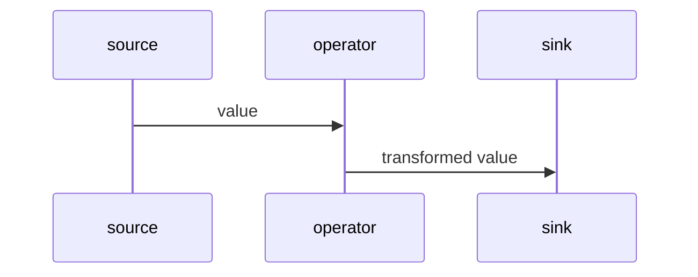
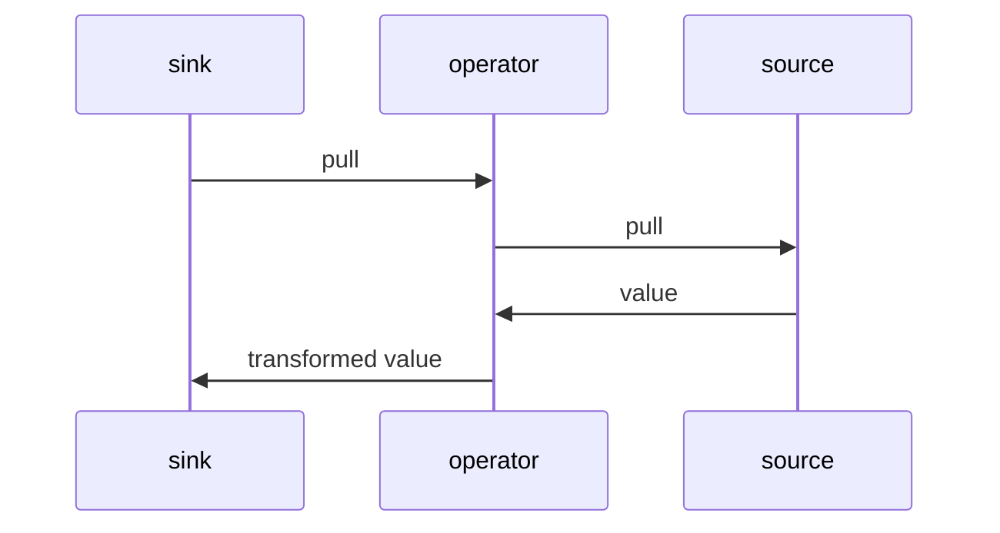

# Rheoscape

## A functional reactive programming library for embedded devices, written in C++.

Rheoscape was written to fill a gap in embedded programming -- a way to easily compose streams of data in the functional reactive style while keeping control over how the streams are executed. In embedded environments this is important: you want to be able to reason about what's happening, when, and how often, so that you can tune your program to squeeze nicely into the constrained hardware you're building for.

Rheoscape comes with a few conveniences for constructing elegant, readable streams using the `|` operator:

```c++
pull_fn set_servo_to_soil_moisture_reading;
pull_fn handle_watering_threshold_input;

void setup() {
    // Soil moisture sensor on GPIO 3.
    static auto soil_moisture_sensor = analog_pin_source(3)
        // We've calibrated the sensor and it's fully wet at 350 and fully dry at 800.
        // Change that range to 0-100%.
        | normalize(Range(800, 350), Range(0, 100));

    // Show the moisture reading on a servo-controlled gauge.
    set_servo_to_soil_moisture_reading = soil_moisture_sensor
        // Translate that into a rotation angle for our servo.
        | normalize(Range(0, 100), Range(0, 180))
        // We have a cheap servo on GPIO 4.
        | servo_sink(4);

    // Allow the user to calibrate the point where the water pump turns on to water the plants.
    static State watering_threshold(50);
    // Rotary encoder on pins 4 and 5.
    static auto rotary_encoder = digital_pin_interrupt_source<4, 5>(INPUT_PULLUP)
        | quadrature_encode;
    handle_watering_threshold_input = make_state_editor(
        rotary_encoder,
        watering_threshold,
        [](QuadratureEncodeDirection dir, int threshold) {
            // QuadratureEncodeDirection::Clockwise maps to +1
            // and CounterClockwise maps to -1.
            threshold += dir;
            // Clamp to 0-100%.
            if (threshold < 0) { threshold = 0; }
            else if (threshold > 100) { threshold = 100; }
            return threshold;
        }
    );

    // Turn the pump on or off depending on the soil reading and the watering threshold.
    watering_threshold.get_source_fn()
        | sample(soil_moisture_sensor)
        | map([](int threshold, int reading) {
            return threshold >= reading
                // Water pump relay is active low.
                ? LOW
                : HIGH;
        })
        // Water pump relay is on GPIO 6.
        | digital_pin_sink(6);
}

void loop() {
    set_servo_to_soil_moisture_reading();
    handle_watering_threshold_input();
}
```

## Important terms

Rheoscape is based on the idea of **streams** between [**sources**](#source) and [**sinks**](#sink). Almost everything in Rheoscape is just a callable. That's the entire core of Rheoscape -- a spec for agreeing on how a source and a sink should interact to create a stream. (But Rheoscape does come with a decent-sized standard library.)

### Source

A source emits values. It's just a function that receives an observer, or [**push function**](#push-function), and whenever it's ready to emit a value, it passes the value to the push function bound to it. It also returns a [**pull function**](#pull-function) when it's called (we'll get to that in a moment).

Here's a type alias for source, pull, and push functions:

```c++
using pull_fn = std::function<void()>;

template <typename T>
using push_n = std::function<void(T)>;

template <typename T>
using source_fn = std::function<pull_fn(push_fn<T>)>;
```

(Note that, while Rheoscape does define these types, it doesn't use them much in the standard library because `std::function` is a type-erased type so the compiler can't optimise long chains of them.)

A source might take its own initiative, pushing its values downstream as they become available, like when an HTTP request comes in or an interrupt fires. We call this a **push source**. (Note that very few sources can actually take initiative without some sort of prodding; we'll talk more about this in [Program flow](#program-flow).)

Or a [**sink**](#sink) (we'll get to sinks in a moment too) might request values from the source by calling the source's pull function. This sink might be an OLED display refreshing, or a GPIO that controls a heater and needs to pull a temperature reading. In most cases, streams are pull-based because it works nicely with the way Arduino programs usually run, with a 'main' control loop that polls things that need to be updated regularly.

You can think of a source function as a stream factory -- you can bind a sink to most sources multiple times and get entirely independent streams. That way, when sink A pulls on a source, it doesn't push a value to sink B's push function. (Not usually anyway -- there are some exceptions.)

Here's a simple source, just a lambda that returns the number 3 whenever it's pulled:

```c++
pull_fn threes_source = [](push_fn<int> push) {
    return [push]() {
        push(3);
    }
}
```

The returned lambda is the pull function that pushes the number 3 to any push function that is passed to it. You can see that a new pull lambda gets created every time the source is called with a new push function.

#### Push function

A push function is a simple observer function. It takes one argument, typed to the value type that the source emits, and does something useful with it. It doesn't return anything.

#### Pull function

As mentioned, a source returns a pull function when it's called. This is a handle that lets the sink request a new value, which will be delivered to the sink's push function.

Not all sources support pulling. Some of them are push-only, in which case its pull function does nothing.

### Sink

A sink isn't a concrete thing; it's more of a concept -- it's just the act of passing a push function to a source and getting a pull function in return. Sinking, or binding, to a source can be as simple as passing a lambda and storing the pull function in a variable for later use. This example uses the `threes_source` from above:

```c++
pull_fn pull_threes = threes_source([](int v) {
    Serial.print("Got a number: ");
    Serial.println(v);
});
```

Every time you call `pull_threes()`, it'll print a message to the serial port.

### Stream

A stream is just a chain of sources and sinks where values flow from the primary source to a final sink.

#### Operator

Something can be both a source and a sink at the same time -- we call these **operators**, and they transform the shape of the stream as it passes downstream from source to sink. Familiar functional operators like `map`, `filter`, and `scan` are included in the standard library. Operators accept a source function (and maybe other arguments) and return a new source function. Here's a simple implementation of `map`:

```c++
template <typename TOut, typename TIn>
source_fn<TOut> map(source_fn<TIn> source, std::function<TOut(TIn)> mapper) {
    // Bind to the upstream source.
    // The upstream source's pull function is passed downstream.
    return source([mapper](TIn value) {
        return mapper(value);
    });
}
```

You'd then use `map` like this:

```c++
source_fn<int> pull_threes_squared = map(
    threes_source,
    [](int v) { return v * v; }
);
```

## Program flow

Rheoscape streams are opinionated about concurrency: they don't do it. Ever. This was an intentional design choice to keep control flow easy to reason about and program for. No mutexes or contention over shared state, no async operations. Either a source pushes a new value all the way down its pipeline, or a sink pulls the next value from its upstream source(s), in a continuous synchronous flow.

\* _That doesn't mean there's no concurrency at all. Some sources use interrupt service routines (ISRs) to collect data in real time, although in practice the ISRs don't actually emit values downstream -- that would make the ISR too heavy and prone to concurrency problems. You still need to pull on the stream to collect waiting values. With ISR-driven sources, we try hard to prevent contention over shared state by temporarily disabling interrupts and taking an atomic snapshot of the values the ISR has written._

Push-only streams flow like this:



Pullable streams flow like this:



In both scenarios, it all happens in a single synchronous stack of function calls. If you want multiple streams to be flowing simultaneously, you have to just pull on them sequentially and hope that they each complete quickly enough to feel simultaneous :)

## Patterns

We've mentioned how Rheoscape is just a pattern for sources and sinks (and, by extension, operators which are both source and sink and let you make long pipes). Here are a couple other patterns you'll see a lot of in the standard library, and you should think about them if you're designing your own sources, sinks, and operators to be reused by other people.

(Note that all of the example implementations here are naïve and don't lend themselves well to compiler optimisation. But you'll find more robust implementations of each of them in the standard library.)

### Source factory

A source factory constructs a source function. A common one is `digital_pin_source`, which takes the GPIO pin you want to listen to and returns a source function that streams the high/low state of that pin. Here's a basic implementation of `digital_pin_source` (there's a more complete implementation in the standard library):

```c++
source_fn<bool> digital_pin_source = [](int pin, int mode) {
    pinMode(pin, INPUT | mode);
    // This is the source function:
    return [pin](push_fn<bool> push) {
        // And this is the pull function:
        return [pin, push]() {
            // Every time downstream requests the pin's state,
            // read it and push the value downstream.
            push(digitalRead(pin));
        }
    }
}

source_fn<bool> gpio_3_source = digital_pin_source(3, INPUT_PULLUP);
pull_fn pull_gpio_3 = gpio_3_source([](bool v) {
    Serial.print("The value of GPIO3 is: ");
    Serial.println(v ? "HIGH" : "LOW");
});
```

### Sink function

A sink function is a function that takes a source and sinks to it -- that is, it binds an internal push function to the source and does something with the source's returned pull function (usually returns it so it can be stored and called later).

```c++
template <typename TReturn, typename T>
using sink_fn = std::function<TReturn(source_fn<T>)>;
```

Here's a sink function that sets the value of GPIO 6:

```c++
sink_fn<bool> gpio_6_sink = [](source_fn<bool> source) {
    pinMode(6, OUTPUT);
    return source([](bool v) { digitalWrite(6, v); });
}
```

That's not very reusable though, so we usually use...

### Sink factory

A sink factory constructs a sink that you can bind to a source.

```c++
sink_fn<bool> digital_pin_sink = [](int pin) {
    pinMode(pin, OUTPUT);
    // This is the sink function, mostly unchanged from the `gpio_6_sink` example above.
    return [pin](source_fn<bool> source) {
        return source([pin](bool v) { digitalWrite(pin, v); });
    };
}

sink_fn<bool> gpio_6_sink = digital_pin_sink(6);
```

Here's something exciting: Rheoscape has a `|` operator overload so you can pipe a source to a sink. So using the sources and sinks we defined above, we can write:

```c++
pull_fn
pull_fn set_gpio_6_to_gpio_3 = gpio_3_source | gpio_6_sink;
```

Or you can just construct the source and sink inline and save a couple lines:

```c++
pull_fn set_gpio_6_to_gpio_3 = digital_pin_source(3)
    | digital_pin_sink(6);
```

### Pipe function

A pipe function receives a single source function, transforms it, and returns a new source function. You can think of it as a sink that produces a source. You can build your own pipes by chaining pipe functions together with the `|` operators.

```c++
template <typename TOut, typename TIn>
using pipe_fn = sink_fn<source_fn<TOut>, TIn>;
```

#### Pipe function factory

A pipe function factory creates a pipe function. Almost all operators in the standard library have a pipe function factory equivalent.Here's an example for `map`:

```c++
template <typename TOut, typename TIn>
pipe_fn<TOut, TIn> map(std::function<TOut(TIn)> mapper) {
    // Here's the pipe function.
    return [mapper](source_fn<TIn> source) {
        return map(source, mapper);
    };
}

pull_fn set_gpio_6_to_opposite_of_gpio_3 = gpio_3_source
    | map([](bool v) { return !v; })
    | gpio_6_sink;
```

## Performance considerations

Rheoscape is designed to do as much of its hard work at compile time as possible. Depending on your needs, you can trade off between larger binary weight and larger call stacks with the `RHEOSCAPE_AGGRESSIVE_INLINE` macro:

<table>
<thead>
<tr>
<th></th>
<th colspan="2"><code>RHEOSCAPE_AGGRESSIVE_INLINE</code></th>
</tr>
<tr>
<th>
<th>defined</th>
<th>undefined</th>
</tr>
</thead>

<tbody>
<tr>
<th>Binary weight</th>
<td>higher ⚠️</td>
<td>lower ✅</td>
</tr>
<tr>
<th>Call stack size</th>
<td>lower ✅</td>
<td>higher ⚠️</td>
</tr>
</tbody>
</table>